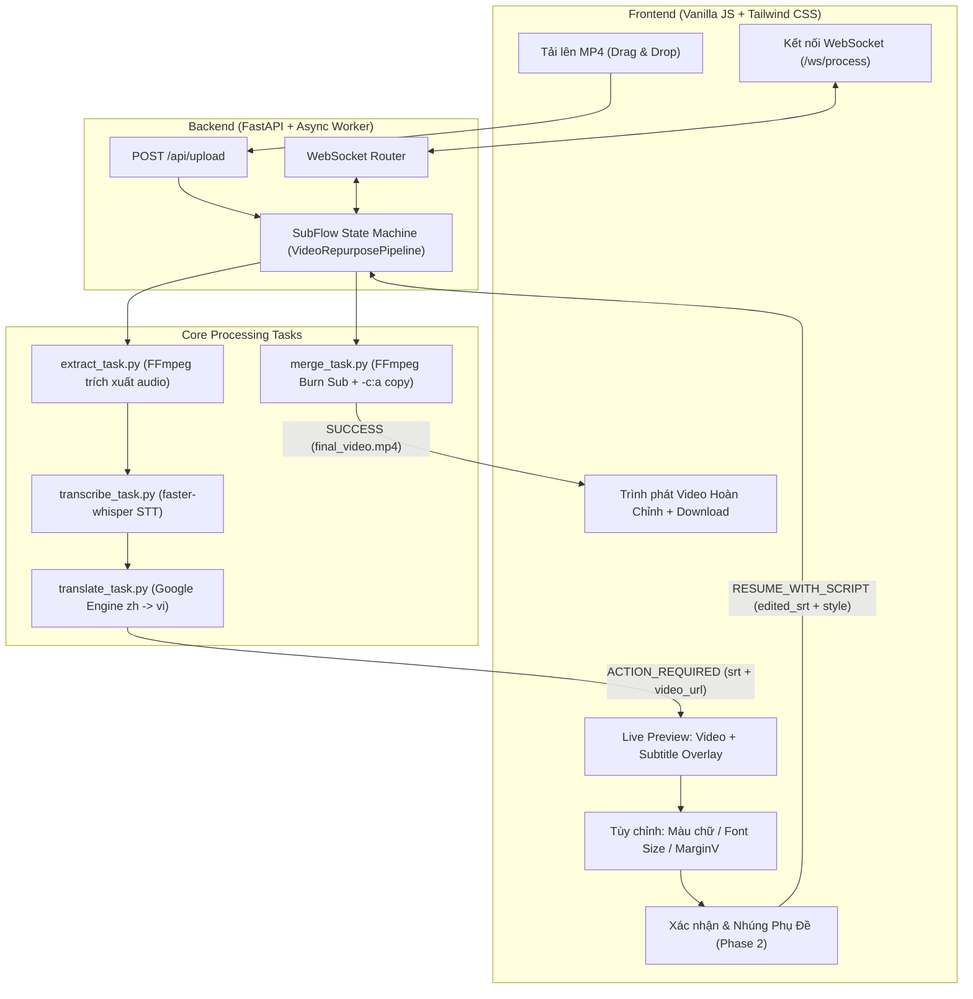

# SubFlow AI 🎬✨

<div align="center">


**Studio tự động hóa bóc tách phụ đề, chuyển ngữ và nhúng Hardsub video 1-Click**  
*Tích hợp trình xem trước tương tác Video & Phụ đề thời gian thực (Real-time Live Sync Preview)*

[Tổng Quan](#-tổng-quan) • [Tính Năng](#-tính-năng-nổi-bật) • [Kiến Trúc](#-kiến-trúc-hệ-thống) • [Cài Đặt](#-hướng-dẫn-cài-đặt) • [Quy Trình](#-quy-trình-vận-hành-human-in-the-loop) • [Tài Liệu Kỹ Thuật](#-tài-liệu-bổ-sung)

</div>

---

## 🌟 Tổng Quan

**SubFlow AI** là giải pháp phần mềm Desktop / Web cục bộ cao cấp, được thiết kế chuyên biệt cho các Content Creator, Video Editor và Publisher trên các nền tảng video ngắn (**TikTok, Douyin, Facebook Reels, YouTube Shorts**).

Hệ thống loại bỏ hoàn toàn quy trình thủ công phức tạp (phải mở qua 4-5 công cụ rời rạc từ bóc sub $\rightarrow$ Google Dịch $\rightarrow$ canh chỉnh timestamp $\rightarrow$ CapCut/Premiere để burn sub). **SubFlow AI** tự động hóa 100% từ khâu trích xuất âm thanh, bóc phụ đề bằng AI cục bộ, dịch thuật bảo toàn mốc thời gian, cho phép xem trước trực tiếp trên video và xuất bản video hoàn chỉnh chỉ với 1 cú nhấp chuột.

---

## ⚡ Tính Năng Nổi Bật

| Tính năng | Chi tiết kỹ thuật | Lợi ích |
| :--- | :--- | :--- |
| **Bóc Sub Cục Bộ (Local STT)** | Sử dụng `faster-whisper` (`base` model, lượng tử hóa `int8` CPU). | **100% Miễn phí**, bảo mật tuyệt đối, không tốn chi phí API và không giới hạn độ dài video. |
| **Dịch Thuật Bảo Toàn Timestamp** | Google Translate Engine đa luồng (`ThreadPoolExecutor`). | Tốc độ dịch chỉ **1-2 giây**, bảo toàn 100% mốc thời gian millisecond `00:00:00,000`, không bao giờ lệch câu. |
| **Interactive Live Subtitle Preview** | Video Player HTML5 đồng bộ trực tiếp với parser SRT client-side qua sự kiện `timeupdate`. | Cho phép xem trước chính xác phụ đề nhảy theo giây trên video trước khi bấm render. |
| **Tùy Biến Phụ Đề WYSIWYG** | Color Picker (#RRGGBB $\rightarrow$ ASS BGR), Font Size Slider (14-32px), MarginV (40-260px). | Thay đổi màu sắc, kích thước và vị trí lề đáy phụ đề hiển thị ngay lập tức trên video preview. |
| **Hardsub Siêu Tốc & Giữ Âm Gốc** | FFmpeg filter `subtitles` + sao chép luồng trực tiếp (`-c:a copy`). | Giữ nguyên 100% chất lượng âm thanh gốc, tăng tốc GPU `h264_nvenc` (tự động fallback `libx264`). |
| **Kiến Trúc Hai Giai Đoạn (HITL)** | WebSocket State Machine hai chiều với trạng thái `ACTION_REQUIRED`. | Người dùng luôn nắm quyền kiểm soát và hiệu đính câu chữ trước khi xuất file. |

---

## 🏗️ Kiến Trúc Hệ Thống



---

## 📂 Cấu Trúc Thư Mục Chuẩn

```text
d:\DVRT/
├── backend/
│   ├── app.py                  # Entry server FastAPI, Static Mount & WebSocket Router
│   ├── config.py               # Biến môi trường & cấu hình đường dẫn thư mục
│   ├── batch_manager.py        # Hàng đợi tác vụ ngầm & quản lý render hàng loạt (Batch Queue)
│   ├── history_store.py        # Lưu trữ và truy xuất lịch sử dự án (outputs/history.json)
│   ├── tasks/                  # Các module xử lý tác vụ độc lập
│   │   ├── extract_task.py     # Trích xuất luồng audio gốc bằng FFmpeg
│   │   ├── transcribe_task.py  # faster-whisper STT cục bộ, chuẩn hóa SRT millisecond
│   │   ├── translate_task.py   # Dịch thuật phụ đề đa luồng bảo toàn timestamp
│   │   └── merge_task.py       # Burn phụ đề chuẩn ASS, escape Windows path & GPU encode
│   └── workflows/
│       └── video_pipeline.py   # State Machine (Phase 1, Auto-Clean tạm thời, Phase 2)
├── frontend/                   # Kiến trúc Multi-file ES Modules (Không cần build step)
│   ├── index.html              # Shell HTML chính, Header Logo SVG, Dropzone & Queue
│   ├── css/
│   │   └── app.css             # Thanh cuộn tùy chỉnh & CSS cho Project History Drawer
│   ├── assets/
│   │   └── logo.svg            # Logo vector cá nhân hóa SubFlow AI
│   └── js/
│       ├── app.js              # Entry script chính, điều phối luồng và sự kiện DOM
│       ├── utils.js            # Trợ hàm parse/serialize SRT, VTT, đổi màu ASS BGR
│       ├── player.js           # Quản lý trình phát video & đồng bộ subtitle overlay WYSIWYG
│       ├── editor.js           # Bộ thẻ phụ đề Interactive Cue Cards, Tách/Gộp/Export
│       ├── pipeline.js         # WebSocket hai chiều & giao tiếp REST Phase 1/Phase 2
│       ├── history.js          # Project History Drawer (trượt từ phải sang)
│       └── batch.js            # Hàng đợi kéo thả nhiều video & render hàng loạt
├── ffmpeg_bin/                 # Thư mục chứa FFmpeg/FFprobe bundled cho bản Desktop .EXE
├── outputs/                    # Thư mục lưu trữ thành phẩm & history.json
├── docs/                       # Tài liệu kiến trúc & đặc tả API chi tiết
├── main_desktop.py             # Entrypoint khởi chạy ứng dụng Desktop cục bộ
├── SubFlowAI.spec              # Cấu hình PyInstaller đóng gói Desktop App kèm FFmpeg
├── build_app.bat               # Script 1-Click đóng gói ứng dụng thành file SubFlowAI.exe
├── run.bat                     # File chạy web app 1-click cho Windows Command Prompt
├── run.ps1                     # File chạy web app cho Windows PowerShell
├── requirements.txt            # Danh sách thư viện Python phụ thuộc
└── README.md                   # Tài liệu hướng dẫn sử dụng chính
```

---

## 🛠️ Hướng Dẫn Cài Đặt

### 1. Yêu Cầu Tiên Quyết
- **Hệ điều hành**: Windows 10/11, macOS, hoặc Linux.
- **Python**: Phiên bản `>= 3.10` (Khuyên dùng Python 3.11).
- **FFmpeg**: Đã được cài đặt và thêm vào biến môi trường hệ thống (`PATH`).

> [!TIP]
> **Cài đặt FFmpeg nhanh trên Windows bằng WinGet:**
> ```powershell
> winget install Gyan.FFmpeg
> ```
> Kiểm tra sau khi cài: `ffmpeg -version` và `ffprobe -version`.

---

### 2. Thiết Lập Môi Trường Ảo & Cài Đặt Thư Viện

1. Mở PowerShell hoặc Terminal tại thư mục dự án:
   ```powershell
   cd d:\DVRT
   ```

2. Tạo môi trường ảo Python:
   ```powershell
   python -m venv venv
   ```

3. Kích hoạt môi trường ảo:
   ```powershell
   # Trên Windows PowerShell:
   .\venv\Scripts\Activate.ps1

   # Trên Windows CMD:
   .\venv\Scripts\activate.bat
   ```

4. Cài đặt các gói phụ thuộc:
   ```powershell
   pip install -r requirements.txt
   ```

---

## 🚀 Khởi Chạy Ứng Dụng

Bạn có thể khởi chạy ứng dụng bằng 1 trong các cách sau:

- **Cách 1 (Khuyên dùng - 1 Click Windows)**: Nhấp đúp vào tệp **`run.bat`**.
- **Cách 2 (PowerShell Launcher)**:
  ```powershell
  .\run.ps1
  ```
- **Cách 3 (Lệnh trực tiếp)**:
  ```powershell
  .\venv\Scripts\uvicorn.exe backend.app:app --host 0.0.0.0 --port 8000 --reload
  ```

Sau khi server khởi động thành công, mở trình duyệt tại:
👉 **`http://localhost:8000`**

---

## 🔄 Quy Trình Vận Hành (Human-in-the-Loop Pipeline)

### Giai đoạn 1: Chuẩn bị & Dịch Tự Động (Prepare Phase)
1. **Tải video lên**: Kéo thả tệp video `.mp4` vào khung upload và bấm **"Bắt đầu chuyển đổi & bóc phụ đề"**.
2. **Trích xuất Audio (20%)**: FFmpeg bóc tách luồng âm thanh gốc thành `audio_goc.mp3`.
3. **Bóc phụ đề AI (50%)**: `faster-whisper` nhận dạng giọng nói tiếng Trung và xuất ra file phụ đề chuẩn SRT `sub_chinese.srt` kèm mốc thời gian chính xác đến millisecond.
4. **Dịch tiếng Việt (75%)**: Hệ thống phân tách từng block SRT, dịch phần văn bản sang tiếng Việt và ghép lại đúng mốc thời gian vào `sub_viet_raw.srt`.
5. **Kích hoạt Live Preview**: Server phát sự kiện WebSocket `ACTION_REQUIRED` kèm URL video gốc và nội dung SRT.

### Giai đoạn 2: Xem Trước Tương Tác & Xuất Bản (Review & Hardsub Phase)
1. **Interactive Preview Player**:
   - Trình phát video bên trái tự động tải video gốc.
   - Khi bấm **Play**, phụ đề tương ứng với giây hiện tại sẽ tự động hiển thị mượt mà trên khung video (`#subOverlay`).
2. **Hiệu đính kịch bản**: Người dùng chỉnh sửa câu từ, thêm bớt từ ngữ địa phương trên khung soạn thảo bên phải (hệ thống tự động cập nhật ngay trên video preview).
3. **Tùy biến Style**:
   - **Màu chữ**: Chọn màu sắc (mặc định Vàng Neon `#FFFF00` chuẩn phong cách video viral).
   - **Cỡ chữ**: Thanh kéo từ `14px` đến `32px` (mặc định `20px`).
   - **Lề đáy (MarginV)**: Thanh kéo từ `40px` đến `260px` (mặc định `140px` - vị trí tối ưu trên TikTok/Reels để không bị che bởi thanh mô tả và âm nhạc).
4. **Xác nhận (Phase 2)**: Nhấn nút **"🎬 Xác nhận & Nhúng phụ đề vào Video"**.
5. **Render Video Hoàn Chỉnh (100%)**:
   - FFmpeg nhúng trực tiếp phụ đề với style đã chọn vào video.
   - Luồng âm thanh gốc được sao chép nguyên bản (`-c:a copy`), không làm giảm chất lượng âm thanh.
   - Thẻ kết quả hiển thị trình phát video hoàn chỉnh, nút **"Tải video về máy"** (`final_video.mp4`) và nút **"Mở thư mục"**.

---

## 📦 Đóng Gói Thành Ứng Dụng Desktop (.EXE)

SubFlow AI có thể được đóng gói thành một file ứng dụng Windows độc lập (Desktop Application) chạy trực tiếp mà không cần cài đặt Python:

- **1-Click Build:** Nhấp đúp vào file **`build_app.bat`** tại thư mục gốc.
- **Tự động đóng gói kèm FFmpeg:** Bộ giải mã FFmpeg và toàn bộ mã nguồn frontend/backend được nén sẵn trong thư mục `ffmpeg_bin/`, người dùng không cần cài thêm bất kỳ công cụ nào.
- **Khởi chạy ứng dụng:** Sau khi build xong, mở file tại:
  ```text
  dist\SubFlowAI\SubFlowAI.exe
  ```
  Ứng dụng sẽ tự động kích hoạt server ngầm và mở trình duyệt mặc định trên máy tính của bạn.

---

## ⚡ Tính Năng Mở Rộng Mới

### 1. Hàng Đợi Sản Xuất Hàng Loạt (Batch Processing Queue)
- **Kéo thả 10–20 video:** Chọn hoặc kéo thả cùng lúc nhiều tệp `.mp4` vào khung tải lên.
- **Hàng đợi ngầm tuần tự:** Hệ thống xếp hàng tự động chạy Phase 1 (bóc sub & dịch) ngầm, bảo đảm không tràn RAM/GPU.
- **Duyệt kịch bản linh hoạt:** Nhấp vào từng video trong hàng đợi để mở bộ thẻ phụ đề và xem trước.
- **Render hàng loạt:** Bấm **"🎬 Render hàng loạt"** để xuất bản tất cả video đã duyệt trong lúc làm việc khác.

### 2. Thư Viện Dự Án / Lịch Sử (Project History Drawer)
- Nhấp nút **"Lịch sử"** ở thanh điều hướng trên cùng để mở Drawer trượt ra từ bên phải.
- Xem danh sách các video đã hoàn thành hoặc đang xử lý theo từng ngày (*Hôm nay, Hôm qua...*).
- Hỗ trợ xem lại video thành phẩm hoặc nhấp **"✏ Chỉnh sửa"** để mở lại dự án và tinh chỉnh phụ đề bất kỳ lúc nào.

### 3. Tự Động Dọn Dẹp (Auto-Clean)
- Tự động xóa file âm thanh trung gian `audio_goc.mp3` ngay khi bóc tách text thành công.
- Tiết kiệm dung lượng ổ đĩa tối đa khi xử lý số lượng lớn video.

---

## 📚 Tài Liệu Bổ Sung

Để tìm hiểu sâu hơn về kiến trúc kỹ thuật và giao thức giao tiếp của dự án:
- 📖 [Kiến Trúc Kỹ Thuật Chi Tiết (ARCHITECTURE.md)](docs/ARCHITECTURE.md)
- 🔌 [Đặc Tả Giao Thức API & WebSocket (API_REFERENCE.md)](docs/API_REFERENCE.md)

---

## 🛡️ Giấy Phép & Bản Quyền

Dự án được phát triển phục vụ mục đích tự động hóa sáng tạo nội dung cá nhân và tối ưu hóa quy trình làm việc cho Content Creator.
Mọi bản quyền thuộc về **SubFlow AI Studio** © 2026.