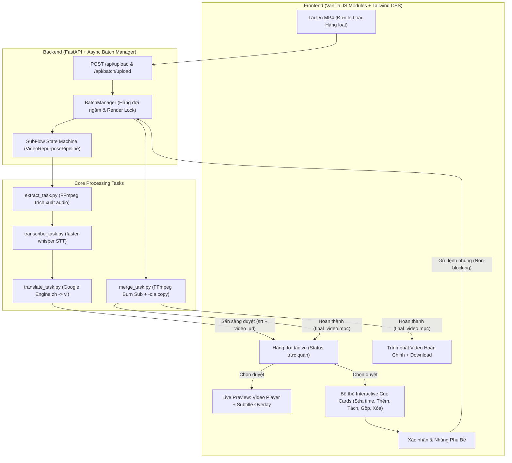

# SubFlow AI 🎬✨

<div align="center">


**Studio tự động hóa bóc tách phụ đề, chuyển ngữ và nhúng Hardsub video 1-Click**  
*Tích hợp trình xem trước tương tác Video & Phụ đề thời gian thực (Real-time Live Sync Preview)*

[Tổng Quan](#-tổng-quan) • [Tính Năng](#-tính-năng-nổi-bật) • [Kiến Trúc](#-kiến-trúc-hệ-thống) • [Cài Đặt](#-hướng-dẫn-cài-đặt) • [Quy Trình](#-quy-trình-vận-hành-human-in-the-loop) • [Tài Liệu Kỹ Thuật](#-tài-liệu-bổ-sung)

</div>

---

## 🌟 Tổng Quan

**SubFlow AI** là giải pháp phần mềm Desktop / Web cục bộ cao cấp, được thiết kế chuyên biệt cho các Content Creator, Video Editor và Publisher trên các nền tảng video ngắn (**TikTok, Douyin, Facebook Reels, YouTube Shorts**).

Hệ thống loại bỏ hoàn toàn quy trình thủ công phức tạp (phải mở qua 4-5 công cụ rời rạc từ bóc sub $\rightarrow$ Google Dịch $\rightarrow$ canh chỉnh timestamp $\rightarrow$ CapCut/Premiere để burn sub). **SubFlow AI** tự động hóa 100% từ khâu trích xuất âm thanh, bóc phụ đề bằng AI cục bộ, dịch thuật bảo toàn mốc thời gian, cho phép xem trước trực tiếp trên video và xuất bản video hoàn chỉnh chỉ với 1 cú nhấp chuột.

---

## ⚡ Tính Năng Nổi Bật

| Tính năng | Chi tiết kỹ thuật | Lợi ích |
| :--- | :--- | :--- |
| **Bóc Sub Cục Bộ (Local STT)** | Sử dụng `faster-whisper` (`base`/`tiny`, lượng tử hóa `int8` CPU & tự động phục hồi CUDA). | **100% Miễn phí**, bảo mật tuyệt đối, không tốn chi phí API và không giới hạn độ dài video. |
| **Dịch Thuật Bảo Toàn Timestamp** | Google Translate Engine đa luồng (`ThreadPoolExecutor`). | Tốc độ dịch chỉ **1-2 giây**, bảo toàn 100% mốc thời gian millisecond `00:00:00,000`, không bao giờ lệch câu. |
| **Tự Động Thích Ứng Phần Cứng** | Tự động phân tách: Render GPU `h264_nvenc` + AI CPU `int8` (hoặc CPU thuần `libx264 veryfast` trên máy yếu). | Tối ưu 100% tài nguyên, máy không card rời vẫn chạy mượt mà, máy có GPU xuất video siêu tốc. |
| **Thực Thi Êm Ái (Zero CMD Popup)** | Toàn bộ tiến trình gọi hệ thống đều chạy ngầm với cờ `CREATE_NO_WINDOW`. | Trải nghiệm đồ họa Studio chuyên nghiệp, **không còn bất kỳ cửa sổ CMD đen nào nhấp nháy**. |
| **Interactive Live Subtitle Preview** | Video Player HTML5 đồng bộ trực tiếp với parser SRT client-side qua sự kiện `timeupdate`. | Cho phép xem trước chính xác phụ đề nhảy theo giây trên video trước khi bấm nhúng. |
| **Bộ Thẻ Biên Tập Tương Tác (Cue Cards)** | Thẻ câu tương tác: `➕ Thêm` (tự tính gap & tịnh tiến câu), `➕ Thêm ở đầu`, `✂️ Tách`, `🔗 Gộp`, `🗑️ Xóa`. | Tự động nhảy mốc và **tạm dừng video (pause)** để soi khẩu hình; sửa thời gian trực tiếp `↑`/`↓` (`±0.1s`). |
| **Đo Lường & Hủy Tác Vụ Tức Thì** | Stream thời gian thực: FPS, Speed `3.2x`, ETA, ticker trích dẫn câu thoại live; nút `[✕ Hủy bỏ]` & `[🔄 Đặt lại]`. | Người dùng nắm toàn quyền kiểm soát, hủy khẩn cấp giải phóng CPU/GPU ngay lập tức nếu cần. |
| **Hàng Đợi & Nhúng Độc Lập (Non-blocking)** | Render FFmpeg chạy bất đồng bộ với cơ chế khóa `asyncio.Lock` chống xung đột phần cứng. | **Không bao giờ làm nghẽn Editor**: có thể chuyển sang duyệt video khác trong khi video trước đang được nhúng. |
| **Hộp Thoại Studio Dark-Theme** | Thay thế 100% `alert()`/`confirm()` bằng Studio Modal (gợi ý khắc phục + chi tiết kỹ thuật) và Toasts nổi. | Giao diện hiện đại, chuyên nghiệp, không làm đơ trình duyệt. |
| **Thanh Điều Hướng & Cài Đặt Desktop** | Desktop Navbar (chuyển tab: Video đơn lẻ / Hàng đợi / Lịch sử) + Trung tâm Cài đặt 6 Tabs. | Tùy biến toàn bộ: chọn thư mục xuất Windows Explorer, nạp/xóa mô hình AI, phông chữ, cỡ chữ, lề đáy. |

---

## 🏗️ Kiến Trúc Hệ Thống



---

## 📂 Cấu Trúc Thư Mục Chuẩn

```text
d:\DVRT/
├── backend/
│   ├── app.py                  # Entry server FastAPI, Static Mount & WebSocket Router
│   ├── config.py               # Biến môi trường & cấu hình đường dẫn thư mục
│   ├── batch_manager.py        # Hàng đợi tác vụ ngầm & quản lý render hàng loạt (Batch Queue)
│   ├── history_store.py        # Lưu trữ và truy xuất lịch sử dự án (outputs/history.json)
│   ├── tasks/                  # Các module xử lý tác vụ độc lập
│   │   ├── extract_task.py     # Trích xuất luồng audio gốc bằng FFmpeg
│   │   ├── transcribe_task.py  # faster-whisper STT cục bộ, chuẩn hóa SRT millisecond
│   │   ├── translate_task.py   # Dịch thuật phụ đề đa luồng bảo toàn timestamp
│   │   └── merge_task.py       # Burn phụ đề chuẩn ASS, escape Windows path & GPU encode
│   └── workflows/
│       └── video_pipeline.py   # State Machine (Phase 1, Auto-Clean tạm thời, Phase 2)
├── frontend/                   # Kiến trúc Multi-file ES Modules (Không cần build step)
│   ├── index.html              # Shell HTML chính, Header Logo SVG, Dropzone & Queue
│   ├── css/
│   │   └── app.css             # Thanh cuộn tùy chỉnh & CSS cho Project History Drawer
│   ├── assets/
│   │   └── logo.svg            # Logo vector cá nhân hóa SubFlow AI
│   └── js/
│       ├── app.js              # Entry script chính, điều phối luồng và sự kiện DOM
│       ├── utils.js            # Trợ hàm parse/serialize SRT, VTT, đổi màu ASS BGR
│       ├── player.js           # Quản lý trình phát video & đồng bộ subtitle overlay WYSIWYG
│       ├── editor.js           # Bộ thẻ phụ đề Interactive Cue Cards, Tách/Gộp/Export
│       ├── pipeline.js         # WebSocket hai chiều & giao tiếp REST Phase 1/Phase 2
│       ├── history.js          # Project History Drawer (trượt từ phải sang)
│       └── batch.js            # Hàng đợi kéo thả nhiều video & render hàng loạt
├── ffmpeg_bin/                 # Thư mục chứa FFmpeg/FFprobe bundled cho bản Desktop .EXE
├── outputs/                    # Thư mục lưu trữ thành phẩm & history.json
├── docs/                       # Tài liệu kiến trúc & đặc tả API chi tiết
├── main_desktop.py             # Entrypoint khởi chạy ứng dụng Desktop cục bộ
├── SubFlowAI.spec              # Cấu hình PyInstaller đóng gói Desktop App kèm FFmpeg
├── build_app.bat               # Script 1-Click đóng gói ứng dụng thành file SubFlowAI.exe
├── run.bat                     # File chạy web app 1-click cho Windows Command Prompt
├── run.ps1                     # File chạy web app cho Windows PowerShell
├── requirements.txt            # Danh sách thư viện Python phụ thuộc
└── README.md                   # Tài liệu hướng dẫn sử dụng chính
```

---

## 🛠️ Hướng Dẫn Cài Đặt

### 1. Yêu Cầu Tiên Quyết
- **Hệ điều hành**: Windows 10/11, macOS, hoặc Linux.
- **Python**: Phiên bản `>= 3.10` (Khuyên dùng Python 3.11).
- **FFmpeg**: Đã được cài đặt và thêm vào biến môi trường hệ thống (`PATH`).

> [!TIP]
> **Cài đặt FFmpeg nhanh trên Windows bằng WinGet:**
> ```powershell
> winget install Gyan.FFmpeg
> ```
> Kiểm tra sau khi cài: `ffmpeg -version` và `ffprobe -version`.

---

### 2. Thiết Lập Môi Trường Ảo & Cài Đặt Thư Viện

1. Mở PowerShell hoặc Terminal tại thư mục dự án:
   ```powershell
   cd d:\DVRT
   ```

2. Tạo môi trường ảo Python:
   ```powershell
   python -m venv venv
   ```

3. Kích hoạt môi trường ảo:
   ```powershell
   # Trên Windows PowerShell:
   .\venv\Scripts\Activate.ps1

   # Trên Windows CMD:
   .\venv\Scripts\activate.bat
   ```

4. Cài đặt các gói phụ thuộc:
   ```powershell
   pip install -r requirements.txt
   ```

---

## 🚀 Khởi Chạy Ứng Dụng

Bạn có thể khởi chạy ứng dụng theo 2 chế độ:

### Chế độ 1: Ứng Dụng Desktop Cục Bộ (Native Window — Khuyên Dùng)
Khởi chạy cửa sổ phần mềm độc lập chuẩn Studio (sử dụng Edge Chromium / PyWebView):
```powershell
.\venv\Scripts\python.exe main_desktop.py
```
*Tự động quét cổng mạng khả dụng (`8000–8999`), khởi động máy chủ ngầm và mở ngay cửa sổ ứng dụng.*

### Chế độ 2: Trình Duyệt Web (Browser Mode)
- **1-Click Windows**: Nhấp đúp vào tệp **`run.bat`**.
- **PowerShell Launcher**: `.\run.ps1`
- **Lệnh trực tiếp**:
  ```powershell
  .\venv\Scripts\uvicorn.exe backend.app:app --host 0.0.0.0 --port 8000 --reload
  ```
  Sau khi khởi động, truy cập trình duyệt tại: 👉 **`http://localhost:8000`**

---

## 🔄 Quy Trình Vận Hành (Human-in-the-Loop Pipeline)

### 1. Bóc Tách & Dịch Thuật Tự Động
1. **Tải video lên**: Kéo thả tệp video `.mp4` vào khung upload và bấm **"Bắt đầu chuyển đổi & bóc phụ đề"** (hoặc chọn nhiều video để đưa vào hàng đợi).
2. **Trích xuất Audio (20%)**: FFmpeg bóc tách luồng âm thanh gốc thành `audio_goc.mp3`.
3. **Bóc phụ đề AI (50%)**: `faster-whisper` nhận dạng giọng nói tiếng Trung và xuất ra file phụ đề chuẩn SRT `sub_chinese.srt` kèm mốc thời gian chính xác đến millisecond.
4. **Dịch tiếng Việt (75%)**: Hệ thống phân tách từng block SRT, dịch phần văn bản sang tiếng Việt và ghép lại đúng mốc thời gian vào `sub_viet_raw.srt`.
5. **Kích hoạt Live Preview**: Server phát sự kiện WebSocket `ACTION_REQUIRED` kèm URL video gốc và nội dung SRT.

### 2. Xem Trước Tương Tác & Hiệu Đính Phụ Đề (Interactive Cue Cards)
1. **Interactive Preview Player**:
   - Trình phát video bên trái tự động nạp video gốc.
   - Khi bấm **Play**, phụ đề tương ứng với giây hiện tại sẽ tự động hiển thị mượt mà trên khung video (`#subOverlay`).
   - **Click vào thẻ bất kỳ**: Video nhảy đến thời gian đầu câu và **tự động TẠM DỪNG (PAUSE)** để soi khung hình / khẩu hình.
2. **Bộ thẻ phụ đề thông minh**:
   - **`➕ Thêm`**: Chèn câu rỗng ngay sau câu đang chọn (tự động lấp khoảng trống hoặc tịnh tiến các câu sau để tránh đè thời gian; tự động focus con trỏ văn bản).
   - **`➕ Thêm ở đầu`**: Thêm một câu rỗng trước câu #1 (tại `00:00.000`).
   - **`✂️ Tách` & `🔗 Gộp`**: Chia đôi một câu dài hoặc gộp 2 câu liền kề.
   - **`🗑️ Xóa`**: Loại bỏ câu phụ đề thừa.
   - **Sửa thời gian trực tiếp**: Nhập số hoặc bấm phím `↑`/`↓` để tăng/giảm nhanh `±0.1s`.
3. **Tùy biến Style**:
   - **Màu chữ**: Chọn màu sắc (mặc định Vàng Neon `#FFFF00` chuẩn phong cách video viral).
   - **Cỡ chữ**: Thanh kéo từ `14px` đến `32px` (mặc định `20px`).
   - **Lề đáy (MarginV)**: Thanh kéo từ `40px` đến `260px` (mặc định `140px` - vị trí tối ưu trên TikTok/Reels để không bị che bởi thanh mô tả và âm nhạc).
4. **Xác nhận & Nhúng**: Nhấn nút **"🎬 Xác nhận & Nhúng phụ đề vào Video"**.
5. **Nhúng Độc Lập & Không Chặn (Non-blocking)**:
   - FFmpeg nhúng phụ đề trong nền với GPU `h264_nvenc` hoặc CPU `libx264`.
   - Luồng âm thanh gốc được sao chép nguyên bản (`-c:a copy`), bảo toàn 100% chất lượng âm thanh.
   - **Không làm nghẽn Editor**: Bạn có thể chuyển sang duyệt video khác trong hàng đợi ngay lập tức trong khi video trước đang được nhúng.

---

## 📦 Đóng Gói Thành Ứng Dụng Desktop (.EXE)

SubFlow AI có thể được đóng gói thành một file ứng dụng Windows độc lập (Desktop Application) chạy trực tiếp mà không cần cài đặt Python:

- **1-Click Build:** Nhấp đúp vào file **`build_app.bat`** tại thư mục gốc.
- **Tự động đóng gói kèm FFmpeg:** Bộ giải mã FFmpeg và toàn bộ mã nguồn frontend/backend được nén sẵn trong thư mục `ffmpeg_bin/`, người dùng không cần cài thêm bất kỳ công cụ nào.
- **Khởi chạy ứng dụng:** Sau khi build xong, mở file tại:
  ```text
  dist\SubFlowAI\SubFlowAI.exe
  ```
  Ứng dụng sẽ tự động kích hoạt server và mở trình duyệt mặc định trên máy tính của bạn.

---

## ⚡ Tính Năng Mở Rộng

### 1. Hàng Đợi Xử Lý Hàng Loạt & Nhúng Độc Lập (Batch Queue & Non-blocking Render)
- **Kéo thả 10–20 video:** Chọn cùng lúc nhiều tệp `.mp4` vào khung tải lên.
- **Xử lý AI tuần tự:** Hệ thống xếp hàng tự động bóc tách & dịch thuật, bảo đảm không tràn RAM/GPU.
- **Trạng thái chi tiết theo thời gian thực:**
  - 🕒 `Chờ xếp hàng`
  - ⚡ `Đang xử lý AI (XX%)`
  - 📝 `Chờ duyệt kịch bản`
  - ✏️ `Đang chỉnh sửa` (highlight viền xanh trên thẻ đang mở trong Editor)
  - 🎬 `Đang nhúng phụ đề...` (FFmpeg đang xử lý độc lập)
  - ✅ `Hoàn thành 100%` (nút `▶ Xem`, `📥 Tải` và `✏️ Sửa`)
- **Duyệt kịch bản linh hoạt:** Nhấp vào từng video trong hàng đợi để mở bộ thẻ phụ đề và xem trước.
- **Nhúng hàng loạt:** Bấm **"🎬 Nhúng hàng loạt"** để xuất bản tất cả video đã duyệt kịch bản.

### 2. Thư Viện Dự Án / Lịch Sử (Project History Drawer)
- Nhấp nút **"Lịch sử"** ở thanh điều hướng trên cùng để mở Drawer trượt ra từ bên phải.
- Xem danh sách các video đã hoàn thành hoặc đang xử lý theo từng ngày (*Hôm nay, Hôm qua...*).
- Hỗ trợ xem lại video thành phẩm hoặc nhấp **"✏ Chỉnh sửa"** để mở lại dự án và tinh chỉnh phụ đề bất kỳ lúc nào.

### 3. Tự Động Dọn Dẹp (Auto-Clean)
- Tự động xóa file âm thanh trung gian `audio_goc.mp3` ngay khi bóc tách text thành công.
- Tiết kiệm dung lượng ổ đĩa tối đa khi xử lý số lượng lớn video.

---

## 📚 Tài Liệu Bổ Sung

Để tìm hiểu sâu hơn về kiến trúc kỹ thuật và giao thức giao tiếp của dự án:
- 📖 [Kiến Trúc Kỹ Thuật Chi Tiết (ARCHITECTURE.md)](docs/ARCHITECTURE.md)
- 🔌 [Đặc Tả Giao Thức API & WebSocket (API_REFERENCE.md)](docs/API_REFERENCE.md)

---

## 🛡️ Giấy Phép & Bản Quyền

Dự án được phát triển phục vụ mục đích tự động hóa sáng tạo nội dung cá nhân và tối ưu hóa quy trình làm việc cho Content Creator.
Mọi bản quyền thuộc về **SubFlow AI Studio** © 2026.