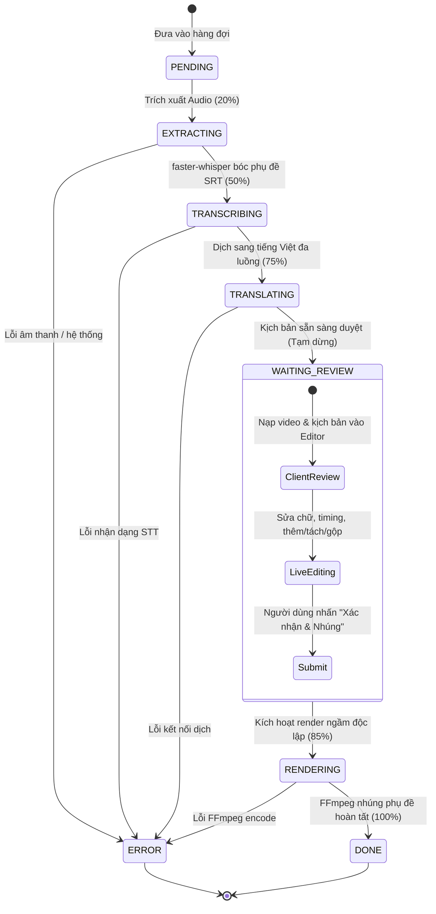

# SubFlow AI — Kiến Trúc Kỹ Thuật (System Architecture)

Tài liệu này mô tả chi tiết thiết kế kiến trúc kỹ thuật của hệ thống **SubFlow AI**, bao gồm máy trạng thái (State Machine), các module xử lý AI cục bộ, công cụ kết xuất FFmpeg, bộ thẻ biên tập phụ đề tương tác (Interactive Cue Cards) và kiến trúc hàng đợi xử lý non-blocking.

---

## 1. Thiết Kế Tổng Thể (High-Level Architecture)

SubFlow AI được xây dựng theo mô hình **Event-Driven Client-Server** kết hợp cơ chế tương tác **Human-in-the-Loop (HITL)** và **Non-blocking Background Rendering**:

```
[Người dùng tải video] ──> [Upload Endpoint / Batch Upload] ──> [Lưu outputs/task_<id>/video_goc.mp4]
                                                                        │
                                                                        ▼
                                                            [Batch Queue / Pipeline Init]
                                                                        │
                                            ┌───────────────────────────┴───────────────────────────┐
                                            ▼                                                       ▼
                                  [Bóc tách & Dịch thuật]                                 [Xem trước & Nhúng phụ đề]
                           • FFmpeg: Trích xuất audio                              • Bộ thẻ Interactive Cue Cards
                           • faster-whisper: STT tiếng Trung                       • WYSIWYG Color / Size / Margin
                           • Google Engine: Dịch tiếng Việt                         • Chỉnh sửa thời gian trực tiếp (↑/↓)
                           • Sẵn sàng duyệt kịch bản                               • Gửi lệnh nhúng không chặn (Non-blocking)
                                            │                                                       │
                                            └────────────► [Giao diện Review] ──────────────────────┘
                                                          • Video Player (Tự dừng khi chọn câu)
                                                          • Hàng đợi đa nhiệm (Duyệt song song)
```

---

## 2. Máy Trạng Thái (Pipeline State Machine)

Vòng đời của một tác vụ trong `backend/workflows/video_pipeline.py` và `backend/batch_manager.py` tuân theo một chuỗi trạng thái hữu hạn (FSM):



---

## 3. Hệ Thống Bóc Tách Phụ Đề Cục Bộ (`faster-whisper`)

### 3.1. Cấu hình Model
- **Thư viện**: `faster-whisper` phiên bản `>= 1.0.0` (dựa trên CTranslate2 engine).
- **Kích thước Model**: `"base"` (khoảng ~140MB), cho độ chính xác cao đối với video ngắn và tốc độ suy luận nhanh.
- **Thiết bị**: `device="cpu"` kết hợp lượng tử hóa `compute_type="int8"`.
- **Khởi tạo Singleton**: Model được nạp toàn cục (Global Variable) một lần duy nhất khi server khởi động, loại bỏ hoàn toàn độ trễ khởi tạo qua các lượt xử lý.

### 3.2. Chuẩn hóa Timestamp SRT
Hàm `format_time(seconds: float) -> str` chuyển đổi giây số thực sang chuẩn phụ đề SRT nghiêm ngặt:
$$\text{Định dạng: } HH:MM:SS,mmm$$
- Bắt buộc đúng 3 chữ số millisecond và sử dụng dấu phẩy (`,`) thay vì dấu chấm (`.`).
- Xử lý biên làm tròn khi millisecond đạt 1000ms để tăng số giây tương ứng.

---

## 4. Công Cụ Dịch Thuật Bảo Toàn Timestamp

Một trong những vấn đề lớn nhất của việc dịch file SRT bằng các công cụ thông thường là mô hình dịch gộp câu hoặc ngắt dòng làm sai lệch mốc thời gian. 

SubFlow AI giải quyết triệt để vấn đề này theo quy trình 3 bước:
1. **Phân tích cú pháp (SRT Parsing)**: Sử dụng biểu thức chính quy (Regex) bóc tách toàn bộ file SRT thành danh sách các Tuple độc lập:
   $$\text{Block} = (\text{index}, \text{timestamp}, \text{chinese\_text})$$
2. **Dịch thuật đa luồng song song**: Chỉ trích xuất phần `chinese_text` để dịch qua Google Translate GTX endpoint bằng `concurrent.futures.ThreadPoolExecutor(max_workers=5)`. Toàn bộ văn bản video được dịch đồng thời chỉ trong 1-2 giây.
3. **Tái tạo cấu trúc (Reconstruction)**: Ghép từng đoạn văn bản tiếng Việt đã dịch vào chính xác `index` và `timestamp` ban đầu. **Tỷ lệ bảo toàn mốc thời gian đạt 100%**.

---

## 5. Bộ Thẻ Biên Tập Tương Tác (Interactive Cue Cards) & Live Sync

### 5.1. Kiến trúc DOM 2 Cột
- **Cột trái**: `<video id="previewPlayer">` hiển thị video gốc, tự động phát hiện và co giãn tỷ lệ (16:9, 9:16 dọc, 1:1, 4:3), kết hợp lớp phủ phụ đề `<div id="subOverlay">` đặt tuyệt đối (`absolute`) trên khung video.
- **Cột phải**: Bộ thẻ phụ đề Interactive Cue Cards trực quan hoặc textarea mã nguồn SRT (Raw Mode).

### 5.2. Thuật toán Thêm Câu & Tự Động Tịnh Tiến (Smart Gap-Filling & Shift)
Khi người dùng bấm **`➕ Thêm`** trên một thẻ phụ đề tại vị trí `index`:
1. Mốc bắt đầu của câu mới: $\text{newStart} = \text{cues}[index].\text{end} + 0.05\text{s}$.
2. Tính khoảng cách tới câu tiếp theo: $\text{gap} = \text{cues}[index+1].\text{start} - \text{newStart}$.
   - **Nếu $\text{gap} \ge 0.8\text{s}$**: Câu mới có thời lượng vừa khít trong khoảng trống mà không ảnh hưởng tới các câu phía sau.
   - **Nếu $\text{gap} < 0.8\text{s}$**: Cấp thời lượng chuẩn $1.2\text{s}$, đồng thời **tịnh tiến thời gian của toàn bộ các câu phía sau** một lượng:
     $$\Delta = (\text{newEnd} + 0.05\text{s}) - \text{cues}[index+1].\text{start}$$
3. Sau khi chèn, trình phát video tự động nhảy tới $\text{newStart}$ và **TẠM DỪNG (PAUSE)**, đồng thời con trỏ văn bản tự động `focus()` vào ô nhập của câu mới.

### 5.3. Điều Chỉnh Timing Trực Tiếp (Inline Time Editing)
- Mốc thời gian `[ ▶ 01:04.500 → 01:05.500 ]` có thể chỉnh sửa trực tiếp.
- Phím mũi tên `↑` / `↓` hỗ trợ tăng giảm nhanh $\pm 0.1\text{s}$ với validation chặn không cho mốc bắt đầu vượt quá mốc kết thúc.

---

## 6. Công Cụ Hardsub FFmpeg & Chuẩn Hóa Đường Dẫn Windows

### 6.1. Quy tắc Escape Đường dẫn Windows trong FFmpeg Filter
Bộ lọc `subtitles` của FFmpeg sử dụng dấu hai chấm (`:`) làm ký tự phân tách tham số nội bộ. Trên Windows, đường dẫn tuyệt đối chứa ký tự ổ đĩa (ví dụ: `D:\DVRT\outputs\...`) sẽ khiến FFmpeg phân tích nhầm ổ đĩa thành tên file và phần còn lại thành tham số thứ hai (`original_size`).

**Quy tắc chuẩn hóa chuẩn xác:**
```python
def format_ffmpeg_sub_path(path: str) -> str:
    abs_path = os.path.abspath(path).replace("\\", "/")
    if len(abs_path) > 1 and abs_path[1] == ":":
        abs_path = abs_path[0] + "\\:" + abs_path[2:]
    return abs_path
```
Kết quả định dạng: `D\:/DVRT/outputs/task_xxx/sub_viet.srt`. Đồng thời, chỉ định tường minh tham số `filename='...'`:
```text
subtitles=filename='D\:/DVRT/outputs/task_xxx/sub_viet.srt':force_style='...'
```

### 6.2. Chuyển Đổi Không Gian Màu CSS Hex sang ASS BGR
- Định dạng CSS Hex (RGB): `#RRGGBB` (Ví dụ màu vàng: `#FFFF00`).
- Định dạng ASS / FFmpeg (BGR): `&H00<BB><GG><RR>&` (Màu vàng: `&H0000FFFF&`).
- Hàm `hex_rgb_to_ass_bgr()` tự động trích xuất các kênh và đảo ngược vị trí Red và Blue.

### 6.3. Tăng Tốc Phần Cứng & Dự Phòng (GPU/CPU Pipeline)
Quá trình render video cố gắng sử dụng phần cứng đồ họa theo thứ tự ưu tiên:
1. **NVIDIA NVENC (GPU)**:
   ```bash
   ffmpeg -i video.mp4 -vf "subtitles=..." -c:v h264_nvenc -preset p4 -cq 23 -pix_fmt yuv420p -c:a copy final_video.mp4 -y
   ```
2. **Fallback libx264 (CPU)**:
   Nếu máy tính không có card NVIDIA hoặc thiếu driver `nvcuda.dll`, hệ thống tự động bắt lỗi `CalledProcessError` và chạy lại bằng bộ mã hóa CPU với preset `veryfast`:
   ```bash
   ffmpeg -i video.mp4 -vf "subtitles=..." -c:v libx264 -preset veryfast -crf 22 -pix_fmt yuv420p -c:a copy final_video.mp4 -y
   ```
3. **Bảo tồn âm thanh gốc**:
   Cả hai phương án đều sử dụng cờ **`-c:a copy`**, sao chép luồng bit trực tiếp (Direct Stream Copy), đảm bảo âm thanh gốc không bị suy giảm chất lượng và giảm tải tối đa cho CPU.

---

## 7. Kiến Trúc Hàng Đợi Bất Đồng Bộ & Non-blocking Rendering

### 7.1. BatchManager Singleton
`backend/batch_manager.py` đóng vai trò điều phối toàn bộ các tác vụ xử lý hàng loạt:
- **`asyncio.Queue`**: Hàng đợi tuần tự xử lý bóc tách âm thanh & dịch AI cho các video mới tải lên nhằm kiểm soát mức sử dụng CPU/RAM.
- **`asyncio.Lock`**: Khóa đồng bộ bảo vệ quá trình render FFmpeg, đảm bảo các tác vụ nhúng video được thực thi tuần tự, tránh hiện tượng nghẽn tài nguyên GPU hoặc quá nhiệt.

### 7.2. Cơ Chế Non-blocking (Không Làm Nghẽn Trình Biên Tập)
- Endpoint `POST /api/batch/render-task` tiếp nhận yêu cầu nhúng phụ đề và phản hồi HTTP `200 OK` ngay lập tức, chuyển tác vụ render sang một background coroutine `asyncio.create_task()`.
- Client nhận phản hồi ngay, cập nhật trạng thái thẻ sang `rendering` (`🎬 Đang nhúng phụ đề...`).
- Người dùng có thể ngay lập tức chuyển sang duyệt kịch bản của bất kỳ video nào khác trong hàng đợi mà không cần chờ video trước render xong.
- Khi render hoàn tất, hệ thống tự động lưu vào lịch sử dự án và cập nhật giao diện client thông qua polling `/api/batch/status`.

---

## 8. Chẩn Đoán Phần Cứng & Cơ Chế Tăng Tốc Kép (Dual-Engine Acceleration)

### 8.1. Kiểm Tra Tính Khả Dụng Thực Tế của cuBLAS (`check_cuda_usable`)
Khác với các công cụ thông thường chỉ kiểm tra sự hiện diện vật lý của GPU bằng `nvidia-smi` hoặc `torch.cuda.is_available()`, SubFlow AI thực hiện kiểm tra sâu mức nhị phân:
- Quét và nạp động `cublas64_12.dll` hoặc `cublas64_11.dll` thông qua `ctypes.CDLL`.
- Tự động bổ sung các thư mục `nvidia.cublas.bin` và `nvidia.cudnn.bin` từ Python `site-packages` vào không gian nạp DLL (`os.add_dll_directory`).
- **Phân tách thông minh (Graceful Degradation)**:
  - **Mã hóa Video (Encoder)**: Dùng **`h264_nvenc`** nếu có GPU NVIDIA (vì chip NVENC hoạt động trực tiếp qua driver màn hình `nvencodeapi64.dll`).
  - **Nhận Diện Giọng Nói (Speech AI)**: Nếu thiếu `cublas64_12.dll`, tự động chuyển sang **`device="cpu"` (`compute_type="int8"`)**.
  - **Máy không có GPU rời**: Tự động chuyển toàn bộ sang **`libx264 veryfast`** + **`cpu int8`**, tối ưu cho CPU 2 nhân đến 8 nhân với bộ nhớ RAM < 500MB.

### 8.2. Cơ Chế Tự Phục Hồi Khi Đang Chạy (Runtime Fallback)
Trong `backend/tasks/transcribe_task.py`, nếu tiến trình bóc băng gặp lỗi CUDA/cuBLAS/OOM giữa chừng:
1. Bắt ngoại lệ và ghi log cảnh báo thân thiện.
2. Tự động khởi tạo ngay lập tức `WhisperModel(model_source, device="cpu", compute_type="int8")`.
3. Tiếp tục bóc băng và cập nhật lại cache singleton `_cached_model`.
4. Người dùng không bao giờ bị gián đoạn hay phải thao tác lại từ đầu.

---

## 9. Kiến Trúc Ứng Dụng Desktop (PyWebView, PyInstaller & Inno Setup)

### 9.1. Khởi Chạy Desktop Đa Luồng Cục Bộ (`main_desktop.py`)
Ứng dụng hoạt động theo kiến trúc Native Desktop Hybrid:
- **FastAPI / Uvicorn Server**: Chạy trên một luồng nền (Daemon Thread) ngầm định.
- **Dynamic Port Resolver**: Quét và tự động cấp phát cổng mạng khả dụng ngẫu nhiên trong khoảng `8000–8999` (`find_free_port()`), triệt tiêu 100% nguy cơ xung đột cổng (`Port already in use`).
- **PyWebView**: Nhúng trình duyệt Edge Chromium (WebView2) chuẩn Windows với kích thước tối ưu 1380x880, hỗ trợ toàn bộ công nghệ HTML5, CSS Grid, WebSocket và SVG.

### 9.2. Trình Phân Giải Đường Dẫn Runtime (`get_bundle_dir`)
Khi chạy dưới dạng mã nguồn Python (`dev mode`) hoặc file thực thi đã đóng gói PyInstaller (`frozen mode`), các tệp tĩnh và nhị phân được định vị an toàn:
```python
def get_bundle_dir() -> Path:
    if getattr(sys, "frozen", False):
        return Path(sys._MEIPASS) if hasattr(sys, "_MEIPASS") else Path(sys.executable).parent
    return Path(__file__).resolve().parent.parent
```
Tự động nạp `ffmpeg_bin/` vào `os.environ["PATH"]` khi khởi động ứng dụng.

### 9.3. Phân Tách Dữ Liệu Người Dùng (%APPDATA%\SubFlowAI)
- **Cấu hình (`settings.json`)** & **Mô hình AI (`models/`)**: Lưu trữ cố định tại `%APPDATA%\SubFlowAI\`.
- Cho phép người dùng gỡ cài đặt hoặc cập nhật phiên bản mới mà **không bị mất** cấu hình hay phải tải lại các mô hình AI dung lượng lớn.

---

## 10. Thực Thi Không Cửa Sổ (`CREATE_NO_WINDOW`) & Kiểm Soát Tác Vụ

### 10.1. Triệt Tiêu Cửa Sổ Console Đen Nhấp Nháy
Mọi tác vụ gọi lệnh hệ thống (FFmpeg extract, FFmpeg burn sub, `nvidia-smi`, Windows folder picker) đều bắt buộc gán cờ ngầm định trên nền tảng Windows:
```python
kwargs["creationflags"] = subprocess.CREATE_NO_WINDOW
```
Đảm bảo trải nghiệm đồ họa mượt mà chuẩn Studio, không có bất kỳ cửa sổ CMD đen nào nhảy lên rồi tắt.

### 10.2. Kiểm Soát Tác Vụ Thời Gian Thực & Hủy Tức Thì (Instant Cancel)
- **Luồng hủy 2 cấp độ**:
  - Hủy tiến trình FFmpeg Popen ngầm ngay lập tức (`proc.kill()`).
  - Hủy vòng lặp generator của Whisper và hàng đợi ThreadPool của Google Translate thông qua cờ kiểm tra `cancel_check()`.
- **Stream thông số chi tiết**:
  - Tốc độ xử lý (FPS, Speed `3.2x`).
  - Mốc thời gian `MM:SS / MM:SS`, số giây còn lại ước tính (ETA).
  - Ticker trích dẫn câu thoại AI vừa bóc được theo thời gian thực.
- **Failsafe Watchdog**: Tự động phát hiện trạng thái treo quá 120 giây không có phản hồi và cảnh báo để người dùng bấm `[🔄 Đặt lại]`.

---

## 11. Hệ Thống Hộp Thoại & Thông Báo Studio (`ui_dialog.js`)
Loại bỏ hoàn toàn các hàm `alert()` và `confirm()` nguyên bản của trình duyệt (vốn làm đơ UI và thiếu thẩm mỹ):
- **Studio Error Modal (`showErrorModal`)**: Hiển thị lỗi có phân cấp gồm tiêu đề thân thiện, gợi ý khắc phục và chi tiết kỹ thuật có thể mở rộng (`<details>`).
- **Studio Confirm Modal (`showConfirmModal`)**: Hộp thoại xác nhận chuẩn phong cách dark-mode (ví dụ khi hủy tác vụ hoặc khôi phục cài đặt gốc).
- **Studio Toast (`showToast`)**: Thông báo nổi góc dưới màn hình với màu sắc phân biệt trạng thái (`success`, `warn`, `error`).
