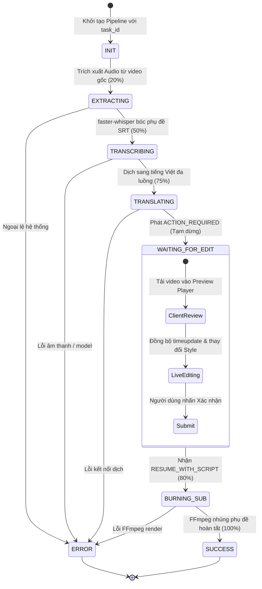

# SubFlow AI — Kiến Trúc Kỹ Thuật (System Architecture)

Tài liệu này mô tả chi tiết thiết kế kiến trúc kỹ thuật của hệ thống **SubFlow AI**, bao gồm máy trạng thái (State Machine), các module xử lý AI cục bộ, công cụ kết xuất FFmpeg và cơ chế đồng bộ phụ đề thời gian thực trên trình duyệt.

---

## 1. Thiết Kế Tổng Thể (High-Level Architecture)

SubFlow AI được xây dựng theo mô hình **Event-Driven Client-Server** kết hợp cơ chế tương tác **Human-in-the-Loop (HITL)** thông qua WebSocket:

```
[Người dùng tải video] ──> [FastAPI Upload Endpoint] ──> [Lưu outputs/task_<id>/video_goc.mp4]
                                                                  │
                                                                  ▼
                                                      [WebSocket Pipeline Init]
                                                                  │
                                      ┌───────────────────────────┴───────────────────────────┐
                                      ▼                                                       ▼
                            [Phase 1: Chuẩn bị]                                     [Phase 2: Xuất bản]
                     • FFmpeg: Trích xuất audio                              • Nhận kịch bản hiệu đính & style
                     • faster-whisper: STT tiếng Trung                       • Ghi đè file sub_viet.srt
                     • Google Engine: Dịch tiếng Việt                         • FFmpeg: Burn hardsub (-c:a copy)
                     • Phát event ACTION_REQUIRED                            • Phát event SUCCESS (final_video.mp4)
                                      │                                                       ▲
                                      └────────────► [Giao diện Review] ──────────────────────┘
                                                    • Video Player + Sub Overlay
                                                    • WYSIWYG Color / Size / Margin
```

---

## 2. Máy Trạng Thái (Pipeline State Machine)

Vòng đời của một tác vụ trong `backend/workflows/video_pipeline.py` tuân theo một chuỗi trạng thái hữu hạn (FSM):



---

## 3. Hệ Thống Bóc Tách Phụ Đề Cục Bộ (`faster-whisper`)

### 3.1. Cấu hình Model
- **Thư viện**: `faster-whisper` phiên bản `>= 1.0.0` (dựa trên CTranslate2 engine).
- **Kích thước Model**: `"base"` (khoảng ~140MB), cho độ chính xác cao đối với video ngắn và tốc độ suy luận nhanh.
- **Thiết bị**: `device="cpu"` kết hợp lượng tử hóa `compute_type="int8"`.
- **Khởi tạo Singleton**: Model được nạp toàn cục (Global Variable) một lần duy nhất khi server khởi động, loại bỏ hoàn toàn độ trễ khởi tạo qua các lượt xử lý.

### 3.2. Chuẩn hóa Timestamp SRT
Hàm `format_time(seconds: float) -> str` chuyển đổi giây số thực sang chuẩn phụ đề SRT nghiêm ngặt:
$$\text{Định dạng: } HH:MM:SS,mmm$$
- Bắt buộc đúng 3 chữ số millisecond và sử dụng dấu phẩy (`,`) thay vì dấu chấm (`.`).
- Xử lý biên làm tròn khi millisecond đạt 1000ms để tăng số giây tương ứng.

---

## 4. Công Cụ Dịch Thuật Bảo Toàn Timestamp

Một trong những vấn đề lớn nhất của việc dịch file SRT bằng các công cụ thông thường là mô hình dịch gộp câu hoặc ngắt dòng làm sai lệch mốc thời gian. 

SubFlow AI giải quyết triệt để vấn đề này theo quy trình 3 bước:
1. **Phân tích cú pháp (SRT Parsing)**: Sử dụng biểu thức chính quy (Regex) bóc tách toàn bộ file SRT thành danh sách các Tuple độc lập:
   $$\text{Block} = (\text{index}, \text{timestamp}, \text{chinese\_text})$$
2. **Dịch thuật đa luồng song song**: Chỉ trích xuất phần `chinese_text` để dịch qua Google Translate GTX endpoint bằng `concurrent.futures.ThreadPoolExecutor(max_workers=5)`. Toàn bộ văn bản video được dịch đồng thời chỉ trong 1-2 giây.
3. **Tái tạo cấu trúc (Reconstruction)**: Ghép từng đoạn văn bản tiếng Việt đã dịch vào chính xác `index` và `timestamp` ban đầu. **Tỷ lệ bảo toàn mốc thời gian đạt 100%**.

---

## 5. Cơ Chế Live Sync & WYSIWYG Preview Trên Trình Duyệt

### 5.1. Kiến trúc DOM 2 Cột
- **Cột trái**: `<video id="previewPlayer">` hiển thị video gốc theo tỷ lệ 9:16, kết hợp lớp phủ phụ đề `<div id="subOverlay">` đặt tuyệt đối (`absolute`) trên khung video.
- **Cột phải**: `<textarea id="srtTextarea">` cho phép chỉnh sửa văn bản trực tiếp.

### 5.2. Thuật toán Đồng bộ Phụ đề (Time-Cued Rendering)
1. **Hàm `parseSRT(srtText)`**: Chuyển đổi chuỗi SRT thành mảng JavaScript các Cue Object:
   ```javascript
   [
     { start: 0.0, end: 1.28, text: "Tên tôi là YT" },
     { start: 3.32, end: 4.10, text: "trên tòa nhà" }
   ]
   ```
2. **Sự kiện `timeupdate`**: Trình duyệt kích hoạt sự kiện mỗi khi video phát:
   ```javascript
   previewPlayer.addEventListener('timeupdate', () => {
     const cur = previewPlayer.currentTime;
     const activeCue = parsedCues.find(c => cur >= c.start && cur <= c.end);
     subOverlay.textContent = activeCue ? activeCue.text : '';
     subOverlay.style.display = activeCue ? 'block' : 'none';
   });
   ```

### 5.3. Tái hiện Đổ bóng Viền Đen (CSS Text-Shadow vs ASS Outline)
Để tạo trải nghiệm xem trước chuẩn xác như video sau khi nhúng bằng FFmpeg, lớp phủ `#subOverlay` được áp dụng bộ đổ bóng CSS đa hướng:
```css
text-shadow: -2px -2px 0 #000, 2px -2px 0 #000, -2px 2px 0 #000, 2px 2px 0 #000, 0 2px 6px rgba(0,0,0,0.8);
```
Điều này tái hiện hoàn hảo bộ lọc `Outline=3, OutlineColour=&H00000000&` của định dạng ASS.

---

## 6. Công Cụ Hardsub FFmpeg & Chuẩn Hóa Đường Dẫn Windows

### 6.1. Quy tắc Escape Đường dẫn Windows trong FFmpeg Filter
Bộ lọc `subtitles` của FFmpeg sử dụng dấu hai chấm (`:`) làm ký tự phân tách tham số nội bộ. Trên Windows, đường dẫn tuyệt đối chứa ký tự ổ đĩa (ví dụ: `D:\DVRT\outputs\...`) sẽ khiến FFmpeg phân tích nhầm ổ đĩa thành tên file và phần còn lại thành tham số thứ hai (`original_size`).

**Quy tắc chuẩn hóa chuẩn xác:**
```python
def format_ffmpeg_sub_path(path: str) -> str:
    abs_path = os.path.abspath(path).replace("\\", "/")
    if len(abs_path) > 1 and abs_path[1] == ":":
        abs_path = abs_path[0] + "\\:" + abs_path[2:]
    return abs_path
```
Kết quả định dạng: `D\:/DVRT/outputs/task_xxx/sub_viet.srt`. Đồng thời, chỉ định tường minh tham số `filename='...'`:
```text
subtitles=filename='D\:/DVRT/outputs/task_xxx/sub_viet.srt':force_style='...'
```

### 6.2. Chuyển Đổi Không Gian Màu CSS Hex sang ASS BGR
- Định dạng CSS Hex (RGB): `#RRGGBB` (Ví dụ màu vàng: `#FFFF00`).
- Định dạng ASS / FFmpeg (BGR): `&H00<BB><GG><RR>&` (Màu vàng: `&H0000FFFF&`).
- Hàm `hex_rgb_to_ass_bgr()` tự động trích xuất các kênh và đảo ngược vị trí Red và Blue.

### 6.3. Tăng Tốc Phần Cứng & Dự Phòng (GPU/CPU Pipeline)
Quá trình render video cố gắng sử dụng phần cứng đồ họa theo thứ tự ưu tiên:
1. **NVIDIA NVENC (GPU)**:
   ```bash
   ffmpeg -i video.mp4 -vf "subtitles=..." -c:v h264_nvenc -preset p4 -cq 23 -pix_fmt yuv420p -c:a copy final_video.mp4 -y
   ```
2. **Fallback libx264 (CPU)**:
   Nếu máy tính không có card NVIDIA hoặc thiếu driver `nvcuda.dll`, hệ thống tự động bắt lỗi `CalledProcessError` và chạy lại bằng bộ mã hóa CPU với preset `veryfast`:
   ```bash
   ffmpeg -i video.mp4 -vf "subtitles=..." -c:v libx264 -preset veryfast -crf 22 -pix_fmt yuv420p -c:a copy final_video.mp4 -y
   ```
3. **Bảo tồn âm thanh gốc**:
   Cả hai phương án đều sử dụng cờ **`-c:a copy`**, sao chép luồng bit trực tiếp (Direct Stream Copy), đảm bảo âm thanh gốc không bị suy giảm chất lượng và giảm tải tối đa cho CPU.
